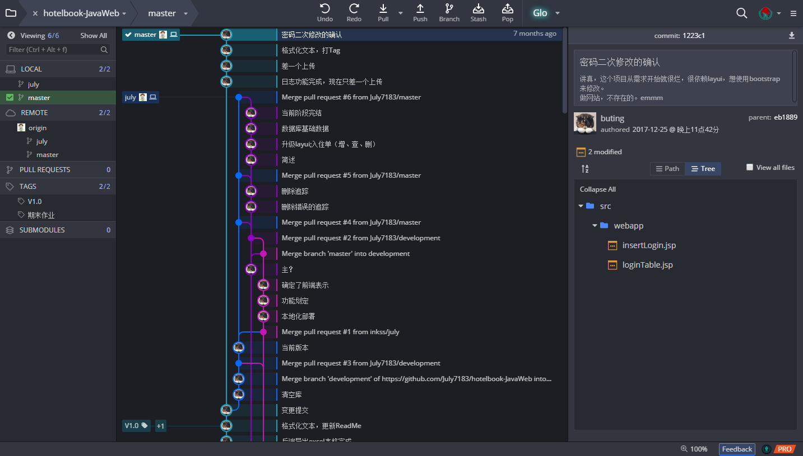

# 酒店管理系统

现在回顾起来才发觉这个写的好烂好烂呀，烂到甚至没有信心在重新拿起这个项目后修改下去了。

不过看着这些提交记录，也算是当时的心血（虽然最后一次提交已然是 7 月前了）。

如果自我评价这个项目，那就是在需求分析阶段就很失败，表现到具体设计上就是功能上想当然（简直白瞎了学那么久软件工程）；而在代码上使用的主要插件 Win10-UI 虽然在界面上很新颖很有特色，但是事实上很不成熟，而且特别依赖这些框架，不好评价 layui 和  bootstrap 谁好谁强，因为都不太会使用，到现在都觉得写前端好可怕加头大。后端上算是应用到 MVC 思想，稍微去做分层（虽然当时只知道应该这样去做而不知为什么）。

项目没有用 Maven 管理，也没有使用 SpringMVC，不过在小学期时因为赖直接在这个基础上进行改造，倒是改成了 SpringMVC + MyBatis （当然需求没动，所以除了后端上的变通其他的改变不是很大，依旧烂）。

相关的链接在这里：https://github.com/inkss/Java-Project/tree/master/hb

然后，因为最近又折腾了服务器，所以直接把 IDEA 编译出的文件扔到服务器上，服务器主要运行 Apache ，做个对域名的跳转再扔给 Tomcat ，嗯就是访问这个链接：https://inkss.cn/hb/ （因服务器到期了或者域名到期或者证书到期了、再或者 CDN 流量包用完造成的链接挂掉概不负责哈哈哈）。

注：因为是直接扔上去的，所以有很多 BUG ，但是登录用的 root toor 还是能用的（密码如果被改了话，呃记得密码用了 MD5 加密后再存的，现在这个网页也就新建用户和改密能用了）。

最后，Spring 是个好东西，多学框架真的很实用。

2018.8.20 补充 ੧ᐛ੭  

------

**### 以下为原内容 ###**

## 一、概述

酒店管理系统，类 Maven 项目结构。项目配置项为：

* 服务器：apache-tomcat-9.0.0.M26

* 数据库：Mysql

* 编辑器：IntelliJ IDEA

## 二、介绍

项目具体说明：[【Wiki】](https://github.com/inkss/hotelbook-JavaWeb/wiki)

JavaWeb 作业，即简单的酒店管理系统。

后端 Java 部分采用 MVC 形式，前端网页主要借鉴 [layui](http://www.layui.com) 与 [win10-ui](http://win10ui.yuri2.cn) 。

目前完成：登录，楼层，房间类型，预订单，日志的增删改查。网页前端功能反倒是全部划分完成。

整体写的七七八八，用了不少第三方的 jar 包，虽然采用了类似Maven的结构，但是本身只是普通的 JavaWeb 项目。

数据库脚本位于`~/src/sql`目录中，导入 mysql 后，用 IDEA 打开重新配置一下 JDK 与 Tomcat 不出意外是可以直接使用的。

附1：Tomcat 的  Deployment 中 Application context值为 /hb 

附2：数据库默认登录账号 root toor

重要：本项目最初是在 Ubuntu 上写的，中间才迁移到 Windows 上，所以数据库上踩了一个坑，Windows 对大小写不敏感，也就是 **Windows 不区分大小写**，数据库建表时表名称含有大写值，对应的就是 DAO 层操控数据库时表名也全是大写，但是在 Windows 下导出的表结构中表名**全是小写**，这里务必注意务必注意务必注意。从某种意义上来说这是数据库设计上遗留的问题。

## 三、

> 寒假将至，如有可能，将继续完善，待更新..