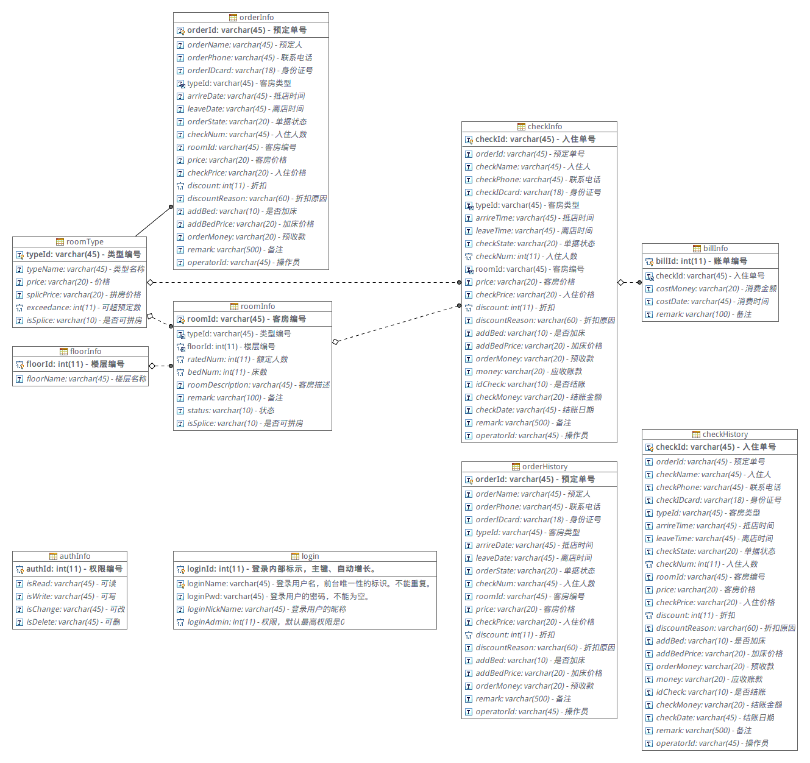

# 酒店管理系统

## 一、概述

酒店管理系统，为大三上学期**JavaWeb课程大作业**。项目配置项为：

* 服务器：apache-tomcat-9.0.0.M26

* 数据库：Mysql 5.7.18-1

* 编辑器：IntelliJ IDEA 2017.0.5

## 二、数据库

### 2.1 数据库ER图

### 2.2 数据库建库脚本

建库sql语句：[SQL脚本](./src/sql/sql.sql)

## 三、项目结构

    hotelbook-JavaWeb
     |-- .idea
     |-- lib
     |-- markdown
     |-- out
          |-- artifacts
               |-- hotelbook_JavaWeb_Web
          |-- production
               |-- hotelbook-JavaWeb
     |-- src
          |-- com
               |-- inks
                    |-- hb
                         |-- common
                         |-- login
                              |-- controller
                              |-- dao
                              |-- pojo
                              |-- service
          |-- resources
          |-- sql
          |-- test
     |-- web
          |-- img
          |-- js
          |-- layui
          |-- login
          |-- MAIN
          |-- WEB-INF
          |-- index.jsp
     |-- hotelbook-JavaWeb.iml
     |-- README.md

## 四、项目介绍

> 待更新..